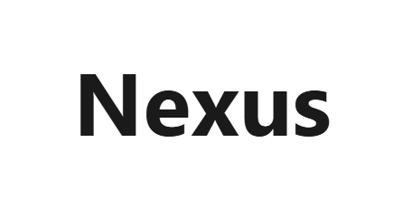
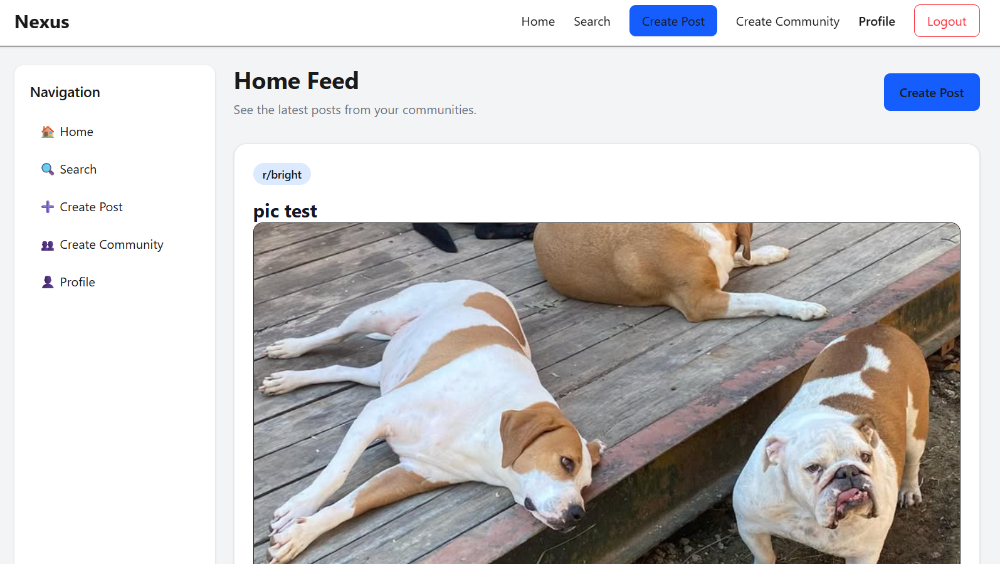
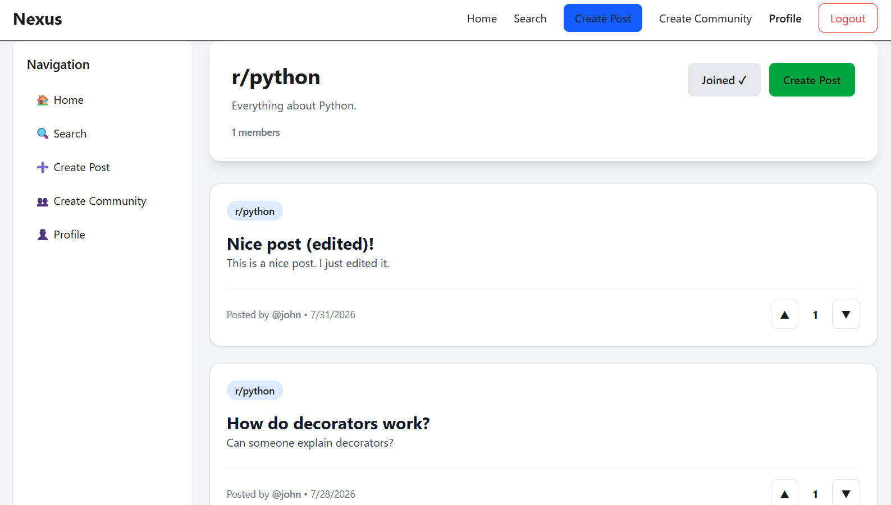
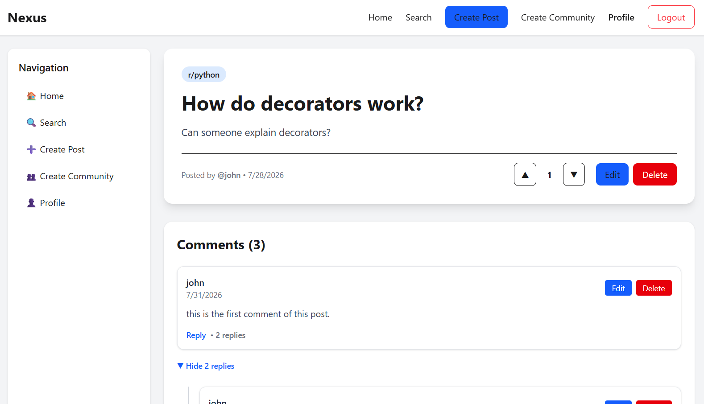
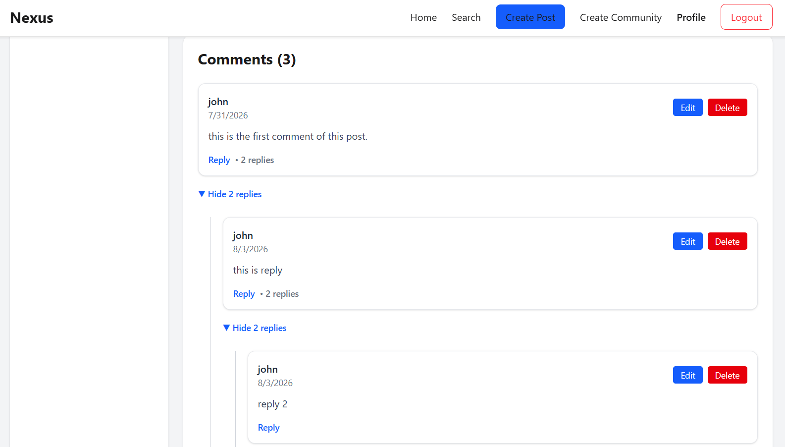
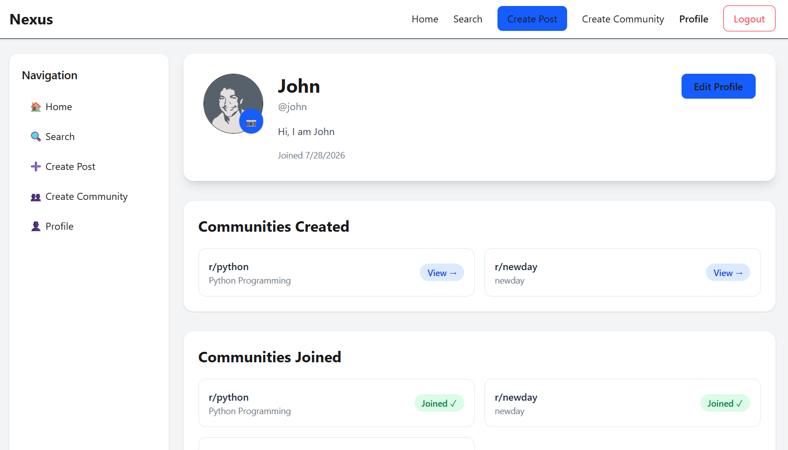

# Nexus

<p align="center">
  
</p>

<p align="center">
A modern Reddit-inspired social discussion platform built with <strong>React</strong>, <strong>FastAPI</strong>, <strong>PostgreSQL</strong>, and <strong>AWS S3</strong>.
</p>

<p align="center">
  <a href="https://nexus.yourdomain.com">🌐 Live Demo</a> •
  <a href="https://api.nexus.yourdomain.com/docs">📖 API Documentation</a> •
</p>

---

## Overview

Nexus is a full-stack social discussion platform inspired by Reddit, designed with modern software engineering practices and scalable architecture.

It enables users to create communities, share posts, upload images, participate in threaded discussions, and engage with content through voting.

The project demonstrates end-to-end application development, including authentication, media storage, REST APIs, relational database design, cloud integration, deployment, and production-ready architecture.

---

# Live Application

| Service | URL |
|---------|-----|
| Frontend | https://nexus.yourdomain.com |
| Backend | https://api.nexus.yourdomain.com |
| API Docs | https://api.nexus.yourdomain.com/docs |

---

# Features

## Authentication

- JWT Authentication
- User Registration
- Login & Logout
- Protected Routes
- Persistent Sessions

---

## User Profiles

- Edit Profile
- Avatar Upload
- Bio & Display Name
- View User Posts
- Created Communities
- Joined Communities

---

## Communities

- Create Communities
- Join / Leave Communities
- Community Feed
- Community Search
- Community Moderation

---

## Posts

- Create Posts
- Edit Posts
- Delete Posts
- Image Upload (AWS S3)
- Voting System
- Community Feed

---

## Comments

- Unlimited Nested Replies
- Edit Comments
- Delete Comments
- Collapse / Expand Replies
- Threaded Discussions

---

## Media

- Avatar Upload
- Post Image Upload
- AWS S3 Storage
- Pre-signed Upload URLs

---

## Search

- Community Search
- User Search
- Post Search

---

## Responsive UI

- Mobile Friendly
- Tablet Support
- Desktop Optimized

---

# Screenshots

## Home Feed

> Add screenshot



---

## Community

> Add screenshot



---

## Post

> Add screenshot



---

## Nested Comments

> Add screenshot



---

## Profile

> Add screenshot



---

# Tech Stack

## Frontend

- React
- React Router
- Axios
- Tailwind CSS
- React Hot Toast
- Vite

---

## Backend

- FastAPI
- SQLAlchemy
- Alembic
- Pydantic
- JWT Authentication

---

## Database

- PostgreSQL

---

## Storage

- AWS S3
- Pre-signed Upload URLs

---

## Deployment

- Docker
- Nginx
- GitHub Actions
- Cloudflare
- HTTPS

---

# Architecture

```
                        Users
                          │
                          ▼
                  React Frontend
                          │
                     REST API
                          │
                          ▼
                     FastAPI Backend
                          │
         ┌────────────────┼────────────────┐
         ▼                ▼                ▼
   PostgreSQL          AWS S3         JWT Auth
         │                │
         └────────────────┘
```

---

# Project Structure

```
Nexus
│
├── backend
│   ├── app
│   ├── alembic
│   └── requirements.txt
│
├── frontend
│   ├── src
│   ├── public
│   └── package.json
│
├── docs
│   └── screenshots
│
├── README.md

```

---

# Getting Started

## Clone Repository

```bash
git clone https://github.com/yourusername/nexus.git

cd nexus
```

---

## Backend

```bash
cd backend

python -m venv .venv

source .venv/bin/activate

pip install -r requirements.txt

alembic upgrade head

uvicorn app.main:app --reload
```

---

## Frontend

```bash
cd frontend

npm install

npm run dev
```

---

# Environment Variables

## Backend

```env
DATABASE_URL=

SECRET_KEY=

ACCESS_TOKEN_EXPIRE_MINUTES=

AWS_ACCESS_KEY_ID=

AWS_SECRET_ACCESS_KEY=

AWS_REGION=

AWS_S3_BUCKET=
```

---

# API Documentation

Interactive OpenAPI documentation is available at

```
https://api.nexus.yourdomain.com/docs
```

---

# Database

The application uses PostgreSQL with SQLAlchemy ORM.

Major entities include:

- Users
- Communities
- Community Members
- Posts
- Comments
- Votes
- Notifications

See:

```
docs/database.md
```

---

# Deployment

Production deployment includes:

- Docker
- Docker Compose
- Nginx Reverse Proxy
- HTTPS
- PostgreSQL
- AWS S3
- GitHub Actions CI/CD

Deployment documentation:

```
docs/deployment.md
```

---

# Roadmap

### Completed

- Authentication
- Communities
- Posts
- Voting
- Nested Comments
- AWS S3 Uploads
- User Profiles
- Community Search

### In Progress

- Notifications
- Moderation Tools
- Community Branding

### Planned

- Direct Messaging
- Real-time Notifications
- OAuth Login
- Markdown Support
- Trending Communities
- Admin Dashboard

---

# Documentation

Detailed project documentation is available in the `docs` directory.

- Architecture
- API Reference
- Database Design
- Deployment Guide
- Development Roadmap

---

# Author

GitHub: https://github.com/yourusername

LinkedIn: https://linkedin.com/in/yourprofile

Portfolio: https://yourportfolio.com